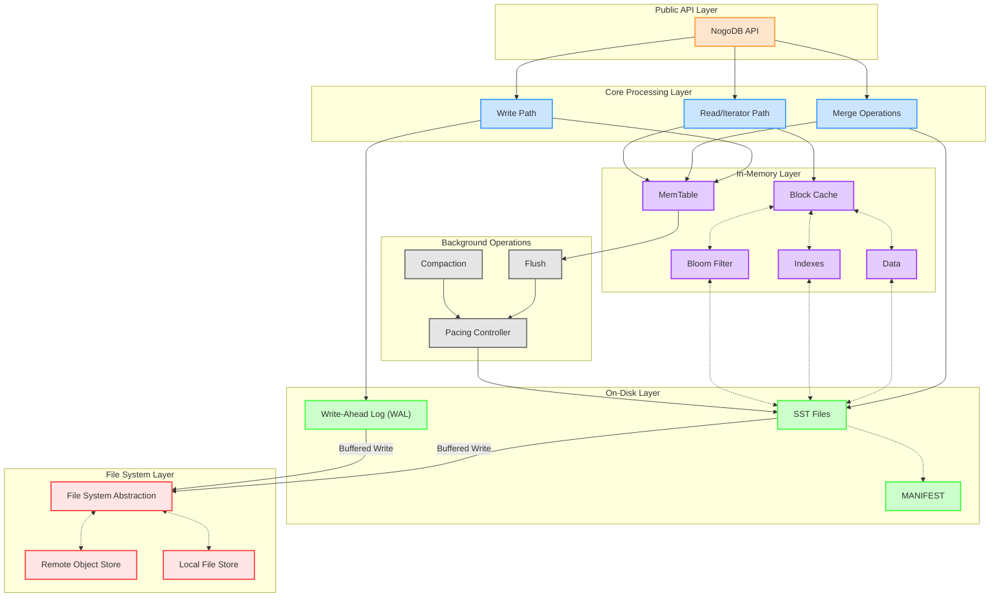

### NogoDB: A Key-Value Storage using Fragmented Log-Structured Merge Tree

>_**Disclaimer**: This project is under development and crafted by human ingenuity—not AI. I won’t let G/AI steal all the fun!_

NogoDB is a key-value embedded storage system inspired by LevelDB and RocksDB. It builds upon RocksDB's file formats while 
incorporating several enhancements, such as range deletion tombstones, table-level bloom filters, and updates to the MANIFEST format.

While key-value stores like LevelDB and RocksDB deliver excellent write throughput, they are often hindered by 
high write amplification—a known issue stemming from the Log-Structured Merge Tree (LSM) data structure that underpins 
these systems. 

To address this tradeoff, NogoDB leverages an advanced data structure called 
Fragmented Log-Structured Merge Trees (FLSM). FLSM introduces the concept of "guards" to organize logs more effectively, 
minimizing data rewriting within the same level and significantly reducing write amplification.

## Architecture (Plan Ahead)

## Test Coverage

| Package | Coverage |
|---------|----------|
| go-adaptive-radix-tree |  |
| go-adaptive-rate-limiter |  |
| go-block-cache |  |
| go-blocked-bloom-filter |  |
| go-bytesbufferpool |  |
| go-context-aware-lock |  |
| go-fs |  |
| go-sstable |  |
| go-wal |  |
