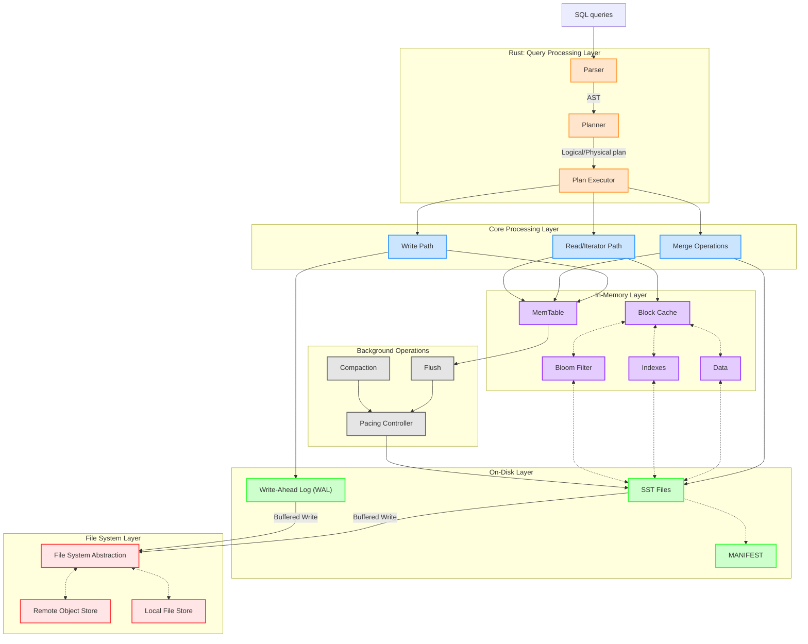

### NogoDB

>_**Disclaimer**: This project is under active development and deliberately crafted by hand and chisel rather than AI. I have no desire to let AI steal the enjoyment of building things by hand. Although AI can produce code faster and boost "__productivity__", that is beside the point. This project is meant a coding exercise to me and deepen my understanding of the database world, not to be rushed into a commercial product and making money from it :)_

    

NogoDB is an OLAP database management system.

I’m not sure what else to add to the description at the moment, as it’s still a work in progress. However, I believe the a brief quote above already gives you all a clear idea of what I’m building :) 

# Architecture (Plan Ahead)

```mermaid
graph TB
    SQL_Query["SQL queries"]
%% Subgraphs with padding for spacing
    subgraph PublicAPI["Rust: Query Processing Layer"]
        style PublicAPI padding:15px
        Parser["Parser"]:::api
        Planner["Planner"]:::api
        PlanExecutor["Plan Executor"]:::api
    end

    subgraph Core["Core Processing Layer"]
        style Core padding:15px
        WritePath["Write Path"]:::core
        ReadPath["Read/Iterator Path"]:::core
        MergeOps["Merge Operations"]:::core
    end

    subgraph Memory["In-Memory Layer"]
        style Memory padding:15px
        BlockCache["Block Cache"]:::memory
        MemTable["MemTable"]:::memory
        BloomFilter["Bloom Filter"]:::memory
        BlockIndex["Indexes"]:::memory
        BlockData["Data"]:::memory
    end

    subgraph Storage["On-Disk Layer"]
        style Storage padding:15px
        SSTFiles["SST Files"]:::storage
        WALog["Write-Ahead Log (WAL)"]:::storage
        ManFile["MANIFEST"]:::storage
    end

    subgraph BackgroundOps["Background Operations"]
        style BackgroundOps padding:15px
        Compaction["Compaction"]:::bg
        FlushOps["Flush"]:::bg
        Pacer["Pacing Controller"]:::bg
    end

    subgraph FileSystem["File System Layer"]
        style FileSystem padding:15px
        FSAbstract["File System Abstraction"]:::fs
        RemoteStore["Remote Object Store"]:::fs
        LocalFile["Local File Store"]:::fs
    end

%% Main flow connections (consistent arrow direction left to right)
    SQL_Query --> Parser
    Parser --> |AST| Planner
    Planner --> |Logical/Physical plan| PlanExecutor
    PlanExecutor --> WritePath
    PlanExecutor --> ReadPath
    PlanExecutor --> MergeOps

    WritePath --> MemTable
    WritePath --> WALog

    MergeOps --> MemTable
    MergeOps --> SSTFiles

    ReadPath --> BlockCache
    ReadPath --> MemTable

    BlockCache <-.-> BloomFilter
    BlockCache <-.-> BlockIndex
    BlockCache <-.-> BlockData
    BlockData <-.-> SSTFiles
    BlockIndex <-.-> SSTFiles
    BloomFilter <-.-> SSTFiles

    MemTable --> FlushOps
    FlushOps --> Pacer
    Compaction --> Pacer
    Pacer --> SSTFiles

    SSTFiles -->|Buffered Write| FSAbstract
    WALog -->|Buffered Write| FSAbstract
    FSAbstract <-.-> RemoteStore
    FSAbstract <-.-> LocalFile
    
    SSTFiles -.-> ManFile

%% Click events only on existing nodes
    click NogoDB_API "xyz"
    click WritePath "xyz"
    click ReadPath "xyz"
    click MemTable "https://github.com/datnguyenzzz/nogodb/tree/master/lib/go-adaptive-radix-tree"
    click BlockCache "https://github.com/datnguyenzzz/nogodb/tree/master/lib/go-block-cache"
    click BloomFilter "https://github.com/datnguyenzzz/nogodb/tree/master/lib/go-blocked-bloom-filter"
    click BlockIndex "xyz"
    click BlockData "xyz"
    click SSTFiles "https://github.com/datnguyenzzz/nogodb/tree/master/lib/go-sstable"
    click WALog "https://github.com/datnguyenzzz/nogodb/tree/master/lib/go-wal"
    click Compaction "xyz"
    click FlushOps "xyz"
    click Pacer "https://github.com/datnguyenzzz/nogodb/tree/master/lib/go-adaptive-rate-limiter"
    click FSAbstract "https://github.com/datnguyenzzz/nogodb/tree/master/lib/go-fs"
    click RemoteStore "xyz"
    click LocalFile "xyz"

%% Styles for groups
    classDef api fill:#FFE5CC,stroke:#FF9933,stroke-width:2px;
    classDef core fill:#CCE5FF,stroke:#3399FF,stroke-width:2px;
    classDef memory fill:#E5CCFF,stroke:#9933FF,stroke-width:2px;
    classDef storage fill:#CCFFCC,stroke:#33FF33,stroke-width:2px;
    classDef bg fill:#E5E5E5,stroke:#666666,stroke-width:2px;
    classDef fs fill:#FFE5E5,stroke:#FF3333,stroke-width:2px;
```