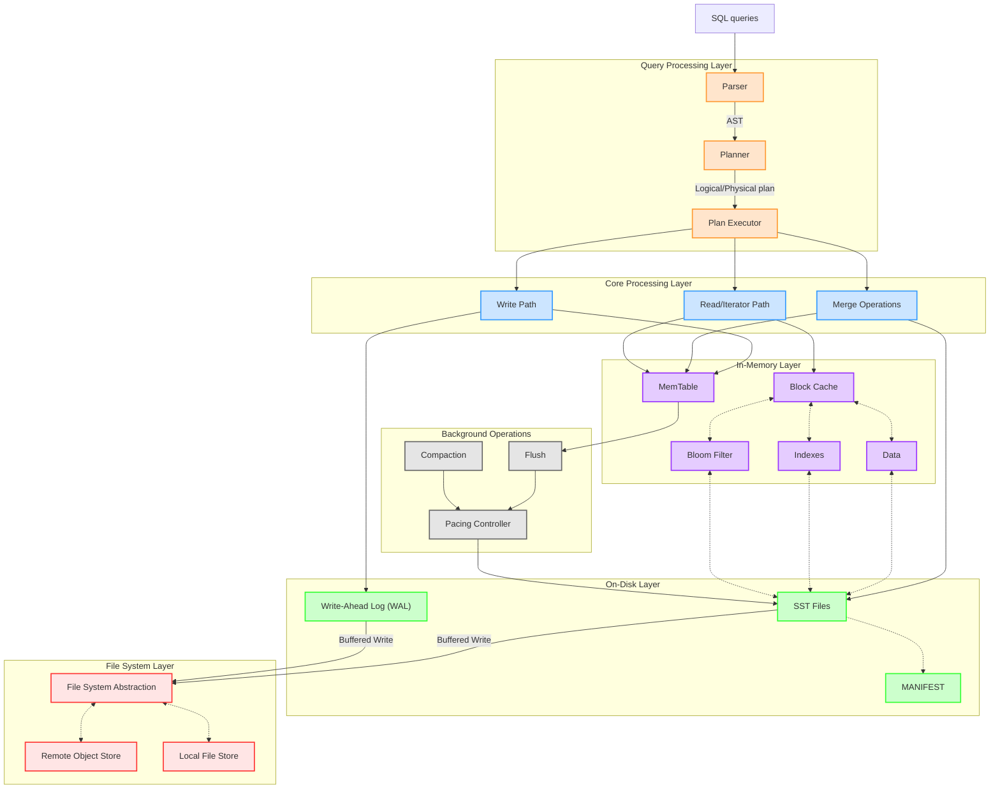

# Project tracker 

## H1 - 2026

- Implement go-fs with the basic file operations
  - [ ] P0: On local disk
  - [ ] P2: Remote storage (S3, ...)
- Add an exhaustive functional tests (writer --> iterator) for the sstable
  - [ ] P0: On-local disk
- [ ] P1: Add benchmark tests for Iterator + Writer
- [x] P0: Implement lock-free concurrent ART and benchmark against the current sequential adaptive radix tree
- [ ] P0: Implement Clock-based eviction policy and benchmark against the LRU policy for the go-block-cache
-   [x] P0: Implement Sharding on the go-block-cache
- [ ] P0: Implement columnar block format in the go-sstable

## H2 - 2025

- [x] Finished implementing writer + iterator for the sstable  
- [ ] Implement go-fs with the basic file operations
  - [x] P0: In-mem
  - [ ] P1: On local disk
  - [ ] P2: Remote storage
- [x] P0: Wire the go-sstable/writer + reader to use the go-fs
- [ ] Add an exhaustive functional tests (writer --> iterator) for the sstable
  - [x] P0: In-mem
  - [ ] P1: On-local disk
- [ ] P2: Add benchmark tests for Iterator + Writer
- [x] P0: Refactor go-wal to use go-fs
- [ ] P1: Implement lock-free Skip list and benchmark against the adaptive radix tree for the MemTable
- [ ] P1: Implement Clock-based eviction policy and benchmark against the LRU policy for the go-block-cache

# Architecture (Plan Ahead)
